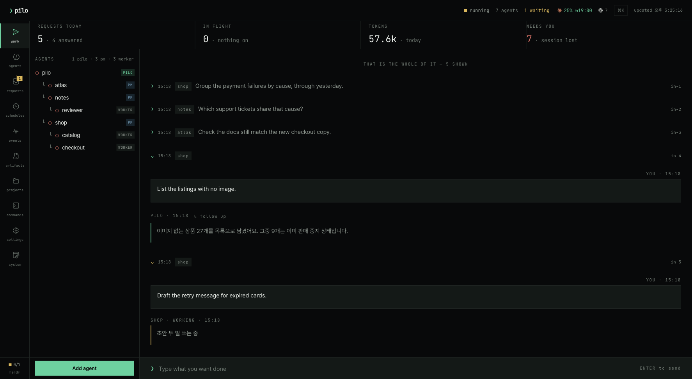
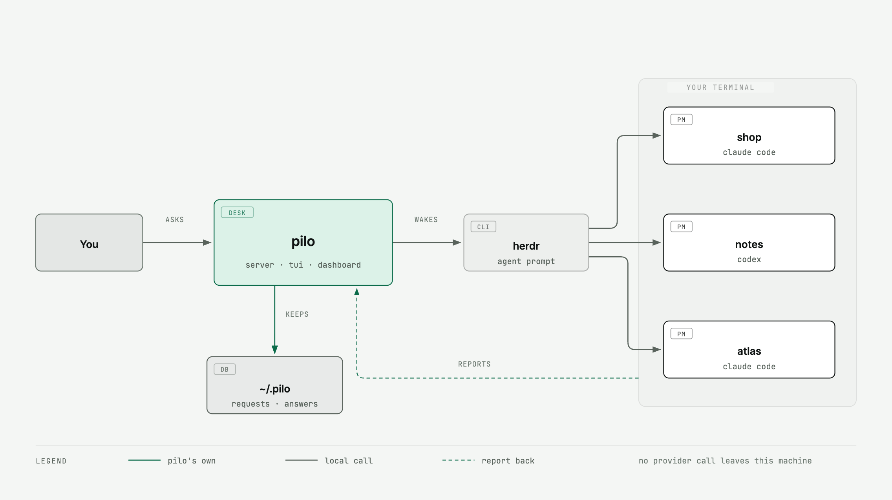
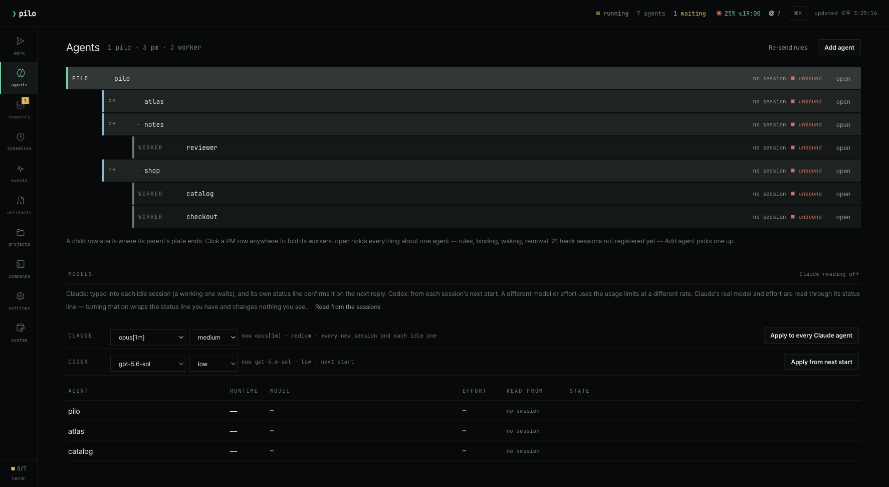
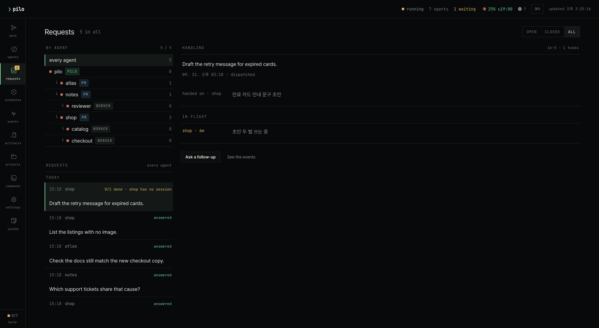

# pilo

**Many agents, one place to talk.**

pilo does not start agents. It gathers the ones already open in your terminal, so
you say a thing once and the owners split the work between them. macOS, local
only, no account.



*The real screen. The desk above is a sample: three projects — `shop`, `notes`,
`atlas` — and five requests that never happened.*

## Why

Three coding agents open is three conversations cut in half. You remember which
window knows about the checkout code, you paste the same context into the second
one, and by the afternoon the answer you wanted is somewhere in a pane you have
already scrolled past.

pilo puts one desk in front of them. You talk to the desk; it decides whose work
a request is, hands it on, and writes back a single answer. What you asked and
what came back is on record, so tomorrow you do not explain it again.

## How it works

Three kinds of agent, and pilo starts none of them:

| | What it does |
| --- | --- |
| **Desk** (`pilo`) | The only one you talk to. Reads the request, decides whose work it is, gathers what comes back and writes one answer. |
| **Owner** (`pm`) | One project, one owner. Reads only its own folder, does the work, reports to the desk. |
| **Specialist** (`worker`) | Sits under an owner and covers one area — review, QA, a second runtime. Reports to its owner, never to you. |

Underneath, three things share the machine:

<picture>
  <source media="(prefers-color-scheme: dark)" srcset="docs/diagrams/architecture-dark.png">
  
</picture>

pilo never launches an agent and never speaks to a provider. It finds the panes
with `herdr agent list`, wakes one with `herdr agent prompt`, and the agent
answers by running `pilo` commands of its own. Everything crosses a unix socket
on your own machine.

## Install

```bash
curl -fsSL https://raw.githubusercontent.com/garamnohhh/pilo/main/install.sh | sh
```

It clones the source into `~/.pilo/app`, installs the two dependencies and links
`pilo` into `~/.local/bin`. Nothing is compiled and nothing asks for sudo — pilo
is a terminal tool, not an app bundle, so Gatekeeper and notarisation never come
into it. *(A shorter address moves here once the homepage is up.)*

Before the first run you need:

| | |
| --- | --- |
| **Node.js 20 or newer** | runs the server, the TUI and the CLI |
| **[herdr](https://herdr.dev)** | the terminal workspace pilo watches — `brew install herdr` |
| **At least one coding agent** | Claude Code or Codex, opened by you in a herdr pane |

To remove it: `rm -rf ~/.pilo/app ~/.local/bin/pilo`. Your requests and their
history stay in `~/.pilo` until you remove that too.

## First run

```bash
pilo                  # start the services and enter the terminal UI
pilo dashboard        # the same desk in a browser
pilo status           # what is running
pilo doctor           # what is missing
```

The first run creates the database under `~/.pilo/data`, enables `pgvector` and
applies the migrations. There is nothing to install first and no password to
keep: the database is a directory only your account can read.

### 1. Register the agents you already have open

Open the Agents tab and press **Add agent**. pilo lists the herdr panes it can
see; you say which project each one owns, and it writes the instruction block
into that folder's `CLAUDE.md` or `AGENTS.md`. The agent reads it on its next
turn and knows how to report back.



An owner reports to the desk; a specialist reports to its owner. The same screen
pins the model and effort each runtime should use, and says when a session has
gone.

### 2. Say what you want done

Type it at the prompt — in the terminal or in the dashboard, they are the same
desk. You do not name an agent. The desk reads the request, splits it when it
belongs to more than one project, and hands each part to the owner of that
folder.

While the work is out, the line under your request says who is holding it and
what they last said about it. When everything lands you get one answer, written
in the language you asked in.

If something finishes *after* that answer was written, the desk comes back and
adds what changed underneath it, rather than leaving the promise unkept.

### 3. Read the trail when you want it



Every request keeps its stages — what you said, who it went to, what each owner
reported, what failed, and the answer that came back. The terminal shows the last
one; the rest is there when you want it, and `pilo history <words>` finds what
you asked last week.

## What else it does

- **Schedules** — standing work on its own clock: `days:weekday@09:00`,
  `days:2d@14:00`, `every:30`. A job whose last run is still open passes its slot
  instead of stacking a second one.
- **Limits** — when a provider's window runs out, pilo parks that runtime until
  it reopens and hands the parked agent's unopened queue to its owner.
- **Notes** — the desk can also speak first: a job that ran, a limit that landed.
  A line of its own, with nothing waiting on it.
- **Decisions** — when an owner needs you to decide something, the question
  arrives in that conversation and your answer goes back to the work.

## What it keeps, and where

Everything pilo keeps lives under `~/.pilo/`: `config.toml`, `port`, `logs/`, and
`data/` — the database itself. There is no container and no separate server: the
database is [PGlite](https://pglite.dev), PostgreSQL 18 compiled to WebAssembly,
opened as a directory of files, with `pgvector` enabled in it.

One process owns that directory at a time. pilo writes `~/.pilo/db.lock` when it
opens the database and refuses to start if another server still holds it — PGlite
has no lock of its own, and two writers would corrupt the files.

Nothing is sent anywhere: no account, no telemetry, no outbound connection. The
only socket that listens is `127.0.0.1`, for the dashboard.

## Commands

The ones you use:

```bash
pilo                  # the terminal UI
pilo dashboard        # the browser desk
pilo inbox [id]       # requests, or one request in full
pilo agents           # id · name · role · project
pilo history <words>  # what was asked, answered and reported before
pilo schedules        # standing work
pilo doctor           # diagnostics
```

Agents have their own set — `pilo task`, `pilo progress`, `pilo done`,
`pilo block`, `pilo reply` — written into their instruction file when you
register them. `pilo help` lists every one.

Inside the terminal UI, `:help` does the same; `:dash`, `:project <name>`,
`:follow`, `:fold`, `:cost` and `:icons` are the ones worth knowing.

## Running a second instance

Every part of the layout moves, which is how a test instance runs beside a real
one: `PILO_HOME`, `PILO_DATA`, `PILO_PORT`, `PILO_SOCKET`, `PILO_SPOOL`, and
`PILO_WATCHER=off` to start without the loop that wakes agents. Move the socket
and the spool together — the CLI falls back from one to the other, so changing
only one leaves it talking to the instance you meant to leave alone.

## Layout

| Path | Role |
| --- | --- |
| `src/server.js` | HTTP API and static serving |
| `src/tui.js` | the terminal UI |
| `src/watcher.js` | inbox → wake → result → answer, every three seconds |
| `src/herdr.js` | session detection and waking |
| `public/dashboard.html` | the dashboard that ships |
| `migrations/` | SQL migrations, applied in order |
| `design/Pilo.dc.html` | the design reference — read-only, never served |

The dashboard and the TUI must match the design file. If exact reproduction is
blocked, the design file changes first.

## Terminal notes

The tree writes what each agent runs in front of its name — a brand glyph where
the icon font has one, three letters where it does not. `:icons off` switches to
letters and keeps the answer for the next run; `PILO_ICONS=off` does it for a
whole shell. No terminal can be asked whether its font carries a glyph, so a
machine without one shows a blank box until someone says so.

`PILO_AMBIGUOUS_WIDTH` forces the East Asian ambiguous width when the startup
probe cannot run.

## Contributing

`npm test` runs the suite (`node --test src/*.test.js`). Push one branch at a
time — `git push origin main`, not `--all` and not `--mirror`: a working copy
picks up refs that are nobody's business in a public repository.

## License

[Apache License 2.0](LICENSE) · Copyright 2026
[garamnoh](https://github.com/garamnohhh) · homepage pilo.pages.dev
*(in preparation)*
